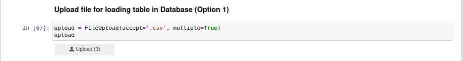

# Assignment

## Part 1 (SQL Proficiency)


### Task: Using the provided sample dataset, perform a series of SQL queries to demonstrate data retrieval and manipulation abilities.

#### 1. List the total number of orders for each product, sorted by the number of orders.

``` sql
WITH ords AS (
    SELECT 
        ProductID, 
        COUNT(OrderID) AS order_cnt 
    FROM 
        Orders 
    GROUP BY 
        ProductID
) 
SELECT 
    dm_product.ProductID, 
    dm_product.ProductName, 
    COALESCE(ords.order_cnt, 0) AS order_cnt 
FROM 
    Products 
LEFT JOIN 
    ords ON Products.ProductID = ords.ProductID 
ORDER BY order_cnt DESC
```

* Firstly, created a CTE `ords` to get product wise count of orders and named the column `order_cnt` from *Orders* table which is the `Orders.csv` file.

* In the main query, selected the `ProductID`, `ProductName` from Products table and used coalesce in the *order_cnt* to ensure that if there are no orders for a product (i.e., order_cnt is null), it shows 0 instead of *null*.

* And then LEFT JOINED with *ords* CTE on `ProductID` which ensures all records from the Products table are included in the result, even if there is no matching record in the ords CTE.

* At lasts the `order_cnt` (Order Count) is sorted in descending order.


#### 2. Find the total revenue generated by each user.

```sql
select
    Users.UserID,
    coalesce(sum(ords.Amount),0) as TotalRevenue
from Users 
left join
    Orders ords on Users.UserID = ords.UserID
group by Users.UserID
order by TotalRevenue desc
```

* Selected the `UserID` from **Users** table to get all the Users who have or haven't placed any orders.
* Did the sum of Amount to get the total revenue and used coalesce to remove null if the user has not brought any revenue.
* At last grouped on `UserID` to get overall Revenue with the column name `TotalRevenue` and sorted on TotalRevenue Column in Descending Order.

#### 3. Display users who have not placed any orders.

```sql
select
    Users.UserID,
    coalesce(sum(ords.Amount),0) as TotalRevenue
from Users 
left join
    Orders ords on Users.UserID = ords.UserID
where TotalRevenue = 0
group by Users.UserID
order by TotalRevenue desc
```

* Used the query from the previous question and added a condition of `TotalRevenue=0`. This will show users who have not palced any order.

## Part 2 (Data Pipeline Construction)

### Task: Develop a data pipeline using Python that ingests data from provided CSV files, processes it, and loads it into a structured database.

* Started off with installing and importing important libraries


`pip install pandas sqlalchemy ipywidgets`

```python

import pandas as pd
from sqlalchemy import create_engine
import logging
from ipywidgets import FileUpload
import io
logging.basicConfig(level=logging.INFO, format='%(asctime)s - %(levelname)s - %(message)s')
```
  

- Created a widget to upload csv file in the notebook. 

```python
upload = FileUpload(accept='.csv', multiple=True)
upload 
```

Below is the screenshot of the result



- Then Created a function to read and Preprocess the File

> In the below code snippet, uploaded data is changed to dataframe  and preprocessing is done by dropping the null value and duplicates.

```python
def read_and_clean_data(uploaded_file, filename):
    try:
        
        # Read data from the uploaded file
        df = pd.read_csv(io.BytesIO(uploaded_file))
        #print(uploaded_file + "\n")
        
        # Handle missing values
        df.dropna(inplace=True)

        # Handle duplicates
        df.drop_duplicates(inplace=True)
        logging.info(f"Data read and cleaned from {filename}")
        
        return df
    except Exception as e:
        print(f"Error Reading/processing file: {e}")
        return None
```

- Created a function `create_database` to setup a conenction with database or creating a new database if its not found

```python
def create_database():
    engine = create_engine('sqlite:///Silq.db')
    logging.info("Database Created and Connected")
    return engine
```


- Processed the uploaded and load it into database in the main function
    
    > - Called the `create_database` function and assigned it a variable named *engine*
    > - Ran a for loop if multiple files are uploaded, this helps in processing all at once.
    > - Inside the loop, called `read_and_clean_data` function for preprocessing the data.
    > - At last the dataframe content is written to a SQL table (table_name) in the database represented by *engine* variable.   


```python 
def main():
    engine = create_database()
    for filename, file in upload.value.items():
        table_name = filename.split('.')[0]  # Assuming table name is the filename without the extension
        df = read_and_clean_data(file['content'], filename)
        if df is not None:
            df.to_sql(table_name, engine, if_exists='replace', index=False)
            logging.info(f"Data loaded into {table_name} table successfully")

if __name__ == "__main__":
    main()
```

## Part 3 (Cohort Analysis Using SQL)

### Task: Perform a cohort analysis on the data using SQL to provide insights into user behavior, focusing on user retention.

#### 1. Group users into monthly cohorts based on their sign-up date.

``` sql
select 
	strftime('%Y-%m', SignUpDate) AS CohertMonth, 
	count(distinct UserID) as NumberOfUsers 
from Users GROUP BY 1;
```

Here in the above query, we have number of users in each cohort.

#### 2. Calculate the retention rate for each cohort over a 3-month period.

Here we assumed that the 3-month period starts from the first order month in each cohort. And then calculating Retention rate in the subsequent months.

As this query is pretty lengthy will try to explain the query here and provide the link below.

- Firstly, created a CTE `FirstOrderMonth` to get user-wise first order month
- Created CTE `UserSignUpFirstOrder`, to get user wise signup and First Order.
- Created CTE `SignUpOrderMonth`, to get Cohort wise first order month and cross joined with M0, M1, M2 months.
- Created CTE `UserActivity` to get user wise order months.
- Created CTE `prelim`, using the **UserActivity** CTE to get user-wise order months which fall under the first three months from first order date.
- Created `Main` CTE, which has count of user under each cohort and under each months (M0, M1, M2).
- At last, in the query, calculated the retention rate by dividing Active User Count with Total User Count.

**Link to the queries for Cohort Analysis:** [Cohort Analysis](https://github.com/antash-mishra/Phoenix/blob/2a3142c44cfdc5348dfb9f9f5e1816bb0d51f6e2/Cohort%20Analysis.ipynb)

At last, created a report basis the above two analysis using streamlit web framework and used plotly to create the visualizations.

**Link to the Report:**  [User-Based Analysis](https://newster-ay2jbq2p7xysy8bxnvkqsb.streamlit.app/)


**Link for SQL Proficiency (Part 1):**  [SQL Proficiency Test](https://github.com/antash-mishra/Phoenix/blob/main/SQL%20Test.ipynb)

**Link for Data Pipleline Creation (Part 2 ):** [Data Pipeline Construction](https://github.com/antash-mishra/Phoenix/blob/main/Data%20Pipeline%20Construction.ipynb)


